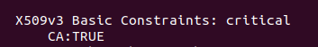
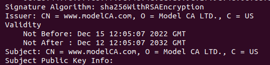
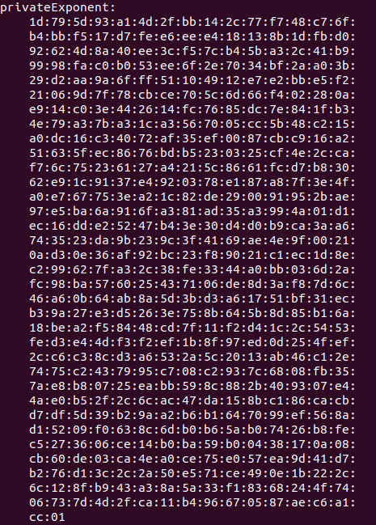
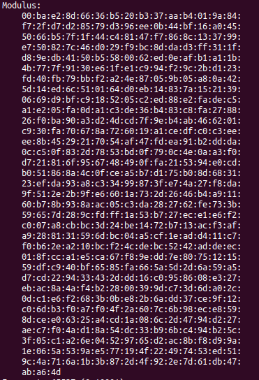
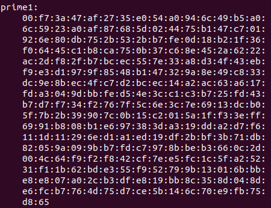
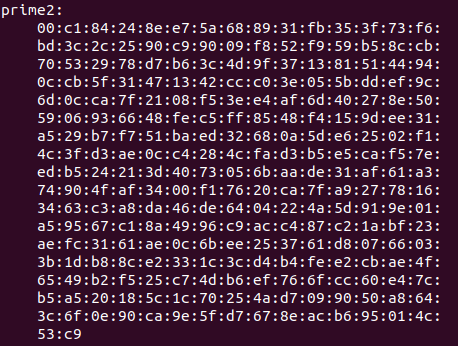
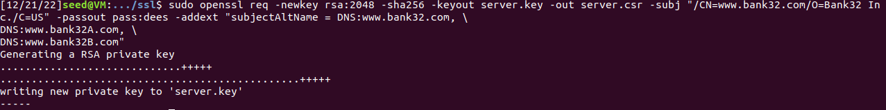
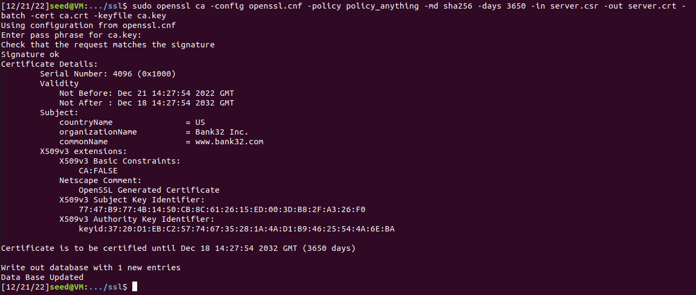
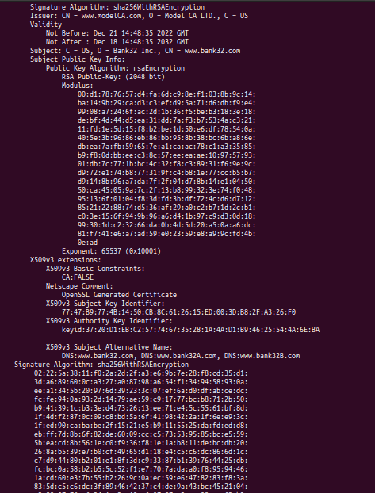

# Log Book 11

## Task 1

### What part of the certificate indicates this is a CA’s certificate?

### What part of the certificate indicates this is a self-signed certificate?
The Issuer is the same as the Subject.

### In the RSA algorithm, we have a public exponent e, a private exponent d, a modulus n, and two secret numbers p and q, such that n = pq. Please identify the values for these elements in your certificate and key files.

- Public exponent, e:

- Private exponent, d:

- Modulus, n:
  

- To find the private key, we need to find the two secret numbers p and q, such that n=p*q:
  - p:
    
  - q:
     

## Task 2
We generated the certificate signing request (CSR).

## Task 3
We generated the certificate.

Print of the decoded content of the
certificate:

## Task 4
...

## Task 5
...

## Task 6
...

---

## CTF 11