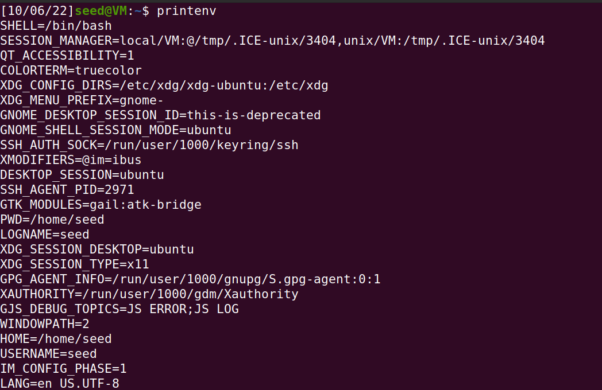
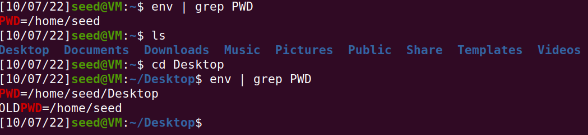
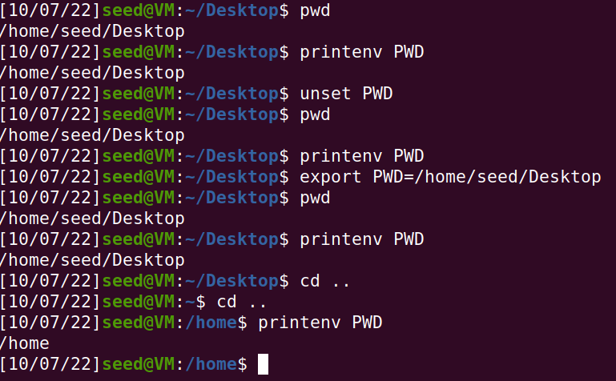

# Log Book 4

## Task 1
An enviromental variable is a variable that is available system wide. As we can see in the screenshot above by using the "printenv" command it prints all the enviroments variables and their current assigned values. For example, the Shell enviroment variable is assigned to the location of the bash executable ie the location where the bash gets "spawned".
In addition, PWD has a value assigned of /home/seed which corresponds to the current user working directory.
Finally, using env | grep <name of the enviroment variable> we can see the value of the desired enviromental variable. For example, the env | grep command gives us the old current working directory (old value of the enviroment varaible) and the current working directory (the new/current value). In addition, the env command can run other commands with modified environments.


> Screenshot of the printenv command outcome
    

> Screenshot of the env command outcome
    
Lastly by using the export and unset commands is possible to set and unset enviroment variables like PWD which has the value of the current working directory. Also the pwd command doesn't get affected by the deletion of the PWD enviroment variable, as you can see on the following screenshot: 
    

> Screenshot of the usage of export and unset commands

## Task 2

## Task 3

## Task 4

## Task 5

### Step 1

When running the given code with the default environment variables and no arguments, the program prints to ```stdout``` all the environment variables of the default user. Since we are testing the program on Seed-Ubuntu, the default user is **seed**.

### Step 2

After compiling the program ```foo.c``` with ```gcc```, we get an executable file ```foo```:

(add image)

Now we can run the following commands for the executable file:
(add image)

Since both these commands require extra privileges, we need to use ```sudo``` to run them.
- The ```chown``` command allows to change the ownership of the executable file to another user, in this case ```root```.
- The ```chmod``` command allows to give read, write and execution permissions. The first digit of ```4755``` sets the ```setuid``` flag. When it is set, it will set the permissions of the user executing the file to the permissions of the owner of the file, which, due to ```chown``` command, happens to be ```root```. In this case the command gives:
    - read, write and execution permission to the owner(7);
    - read and execute permissions to the group and others (55).

The following image shows the permissions for the executable file ```foo```:
(add image)

### Step 3

We used the command ```export``` to set the following environment variables:
(add image)

With the following images, we can conclude that both ```PATH``` and ```TEST``` variables remain the same but the ```LD_LIBRARY_PATH``` isn't inherited when running the program.
(add image)
(add image)

## Task 6

---

## CTF 4

- **Wordpress version**: 5.8.1
- **Installed plugins + version**: Woocommerce 5.7.1
- **Possible users**: admin, Orval Sandford

This vulnerability is identified by the CVE-2021-34646.
It has a CVSS score of 7.5 and it's type is *Bypass a restriction or similar*. ([CWE-330](https://cwe.mitre.org/data/definitions/330.html))
More information about this vulnerability can be found [here](https://cve.mitre.org/cgi-bin/cvename.cgi?name=CVE-2021-34646) and [here](https://www.cvedetails.com/cve/CVE-2021-34646/?q=CVE-2021-34646).

After finding the CVE, we could search it in a exploit database. In this case we used [this](https://www.exploit-db.com/exploits/50299) database, where we found a exploit code that would help us break into the admin account without needing any kind of log in verification.

The program just needed the target website and a user id to run, and since we want to attack the admin account, we figured the user id must be either 0 or 1.
After running the given Python program, we obtained the following output:
(image here)

Then, all we needed to do was access the target website with the url generated by the program and we are inside the admin account.

After browsing through the website in admin mode, we found a private post that had the flag of the CTF.
