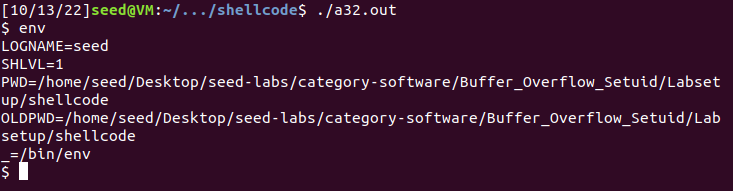
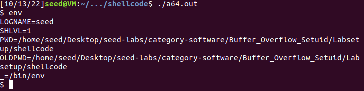

# Log Book 5

## Environment Setup
### Turning off countermeasures
For this lab, we need to disable security mechanisms that make buffer-overflow attacks more difficult.

#### Address Space Randomization
Deactivates address space randomization making guessing addresses more easier to be able to do a buffer-overflow attack.

```bash
$ sudo sysctl -w kernel.randomize_va_space=0
```

#### Configuring /bin/sh
Links the ```/bin/sh``` to another shell that does not have the security countermeasure that bash uses that prevents itself from being executed in a Set-UID process.

```bash
$ sudo ln -sf /bin/zsh /bin/sh
```

#### StackGuard and Non-Executable Stack.
Deactivates two more countermeasures implemented in the system. They will be turned off during compilation.

## Task 1

To compile the shell code given by Seed, we used the Makefile also given by Seed. It generates two executable files, one being a 32-bit shell and another being a 64-bit shell.
When executed, both binary files open a shell. These shells support running commands as usual, but deleting characters doesn't give visual feed. Deleting a char from the command line deletes it from the buffer, but it remains on screen.

The following images show the environment variables of both shells:




As we can see from the images, these shells include both a ```PWD``` and ```OLDPWD``` and a ```SHLVL``` variable, but there's no ```PATH``` variable defined.

## Task 2
In this task we have a file named stack.c which has a buffer overflow vulnerability. Firstly, we open a file named "badfile" and copy its first 517 characters to a char array named str. After that we invoke the dummy function passing by argument the string buffer which then calls the bof function which uses the strcpy function to copy the string buffer content to another char buffer with only 100 characters capacity. Once, strcpy has no boundary check it would originate a buffer overflow, once we are copying a larger sized string to a smaller sized one. Lastly, by manipulating badfile, e.g writing 100 characters and after that shellcode we could exploit this buffer overflow due to the bof strcpy vulnerability and gain the root privilege due to this Set-UID bit being set.

## Task 3

## Task 4 (optional)

## Task 5 (optional)

---

## CTF 5
