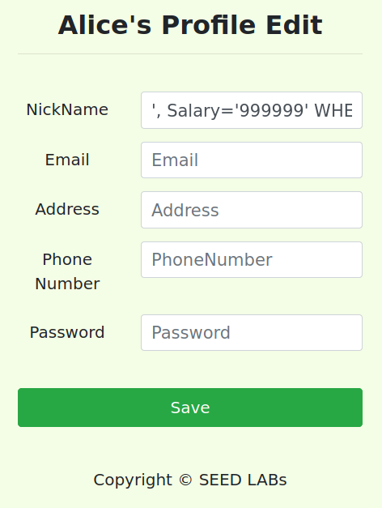
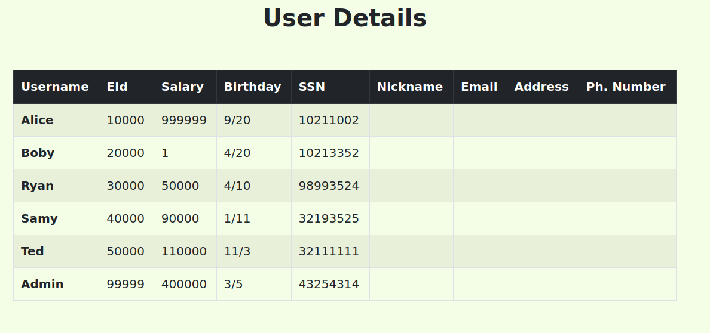

# Log Book 8

## Task 1
...

## Task 2
##### SQL injection is basically a technique through which attackers can execute their own malicious SQL statements generally referred as malicious payload. Through the malicious SQL statements, attackers can steal information from the victim database or even worse they may be able to make changes to the database. Our employee management web application has SQL injection vulnerabilities, which mimic the mistakes frequently made by developers.

### Task 2.1
##### Log in into the web application as the administrator from the login page, so that you can see the information of all employees. Exploiting the php query vulnerability.
  
##### The single quote after entering a valid username existing in the database, closes the argument for the input username and the # sign consequently makes everything after the username to be commented out.
  
##### Hence, we were able to get all the information about the employees using the admin ID.

### Task 2.2
##### Repeat Task 2.1 but from the command line using curl. We use the curl command to place an HTTP request to the webapplication and perform the login from the command line.
  
##### For the username we need to pass **admin'\#** which are special caracters, and therefore need to be enconded. We used the following encodings **Quote (') -> %27** and **Hash (\#) -> %23**.
  

### Task 2.3
##### There is a countermeasure preventing you from running two SQL statements in this attack. Please use the SEED book or resources from the Internet to figure out what this countermeasure is, and describe your discovery in the lab report.
  
##### This SQL injection does not work in MySQL because PHP's mysqli extension, mysqli::query() API does not allow multiple queries to run in the databse server. The limitation is inserted by the extension not the SQL server itself. This mysqli limitation can be overcome by using mysqli->multiquery().

## Task 3
##### If a SQL injection vulnerability happens to an UPDATE statement, the damage will be more severe, because attackers can use the vulnerability to modify databases. In our Employee Management application, there is an Edit Profile page (Figure 2) that allows employees to update their profile information, including nickname, email, address, phone number, and password. To go to this page, employees need to log in first.

### Task 3.1
##### Modify your own salary.
  
  
##### To modify Alice's salary we used the NickName text box to run the specific MySQL command : Alice', Salary='999999' WHERE Name="Alice"#.

### Task 3.2
##### Modify other people’ salary.
  
  
##### To modify Boby's salary we used the NickName text box to run the specific MySQL command : Alice', Salary='1' WHERE Name="Boby"#.

### Task 3.3
##### Modify other people’ password.
  
##### To modify Boby's password we used the Address text box to run the specific MySQL command : ',Password=sha1('123') WHERE Name="Boby"#.
  
  
##### Then we used that password to login as Boby -> username: Boby | password: 123

---

## CTF 8

### Challenge 1
...

### Challenge 2
...
